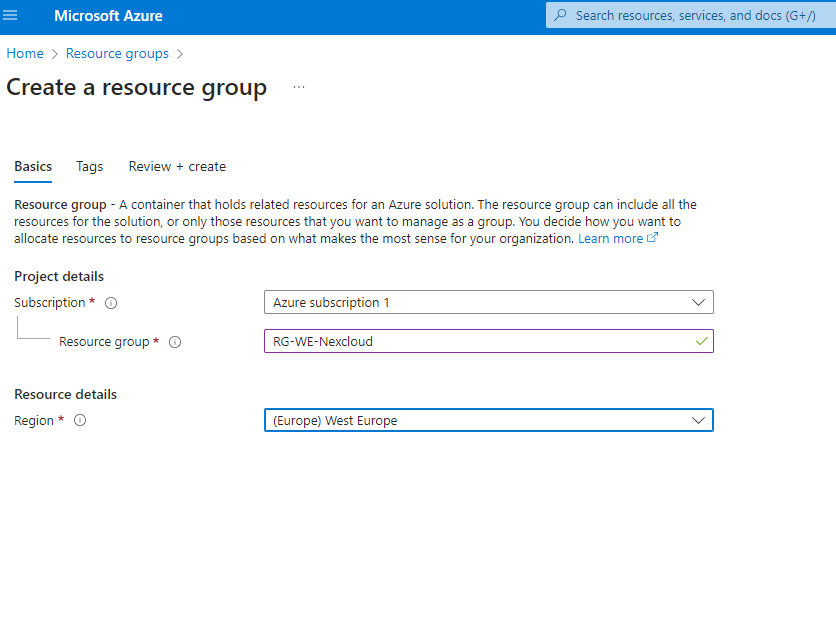
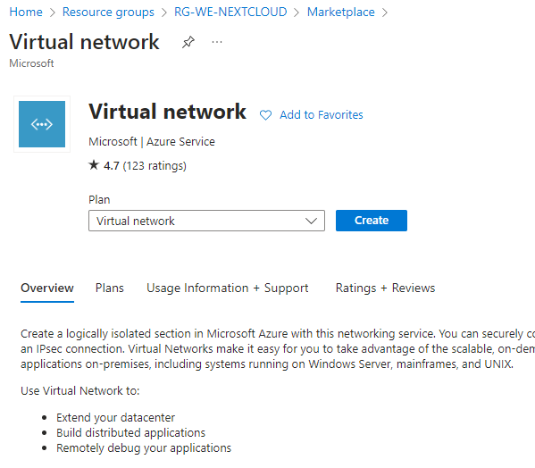

# Create a Virtual Machine and Deploy a Web Server
In this Project, I will create a Virtual Machine in Azure to deploy a web server, specifically a Nextcloud server.
Course Objectives

# Project Structure
## The hands-on project on Azure: create a Virtual Machine and deploy a web server is divided into the following tasks:

1. Create a Resource Group

2. Create a Virtual Network and a subnet

3. Protect a subnet using a Network Security Group

4. Deploy Bastion to connect to a Virtual Machine

5. Create an Ubuntu Server Virtual Machine

6.  Install Nextcloud by connecting via SSH using Bastion

7. Publish an IP

8. Create a DNS label

## The goal of this project is to understand how the basic networking architecture in Azure works by creating Virtual Networks, subnets, security groups, and Virtual Machines. Also to learn how to use Bastion to connect to a Linux machine using SSH without exposing an external IP. And  also to  learn how to expose a public IP and an HTTPS port to access your web server.

### 1. Create a Resource Group 
This Resource Group will allow us to group all the resources into a logical group

### 2.  Create a Virtual Network inside the Resource Group
A Virtual Network is a logical network that enables different resources to communicate securely with each other,
as if they were physically connected. 
It also helps us filter connections between our internal resources and the Internet.

### 3. Create a Network Security Group to protect the internal Subnet of the Virtual Machine 
A security group helps us filter traffic to and from Azure resources inside the Virtual Network.
This allows us to allow or deny inbound and outbound traffic to end from different Azure resources and also to the Internet.

### 4. Create an Azure Bastion Instance to connect to our Virtual Machine
  -To use Bastion to connect to our Virtual Machine, we need to create a subnet for it first.

### 5. Create a Virtual Machine 
